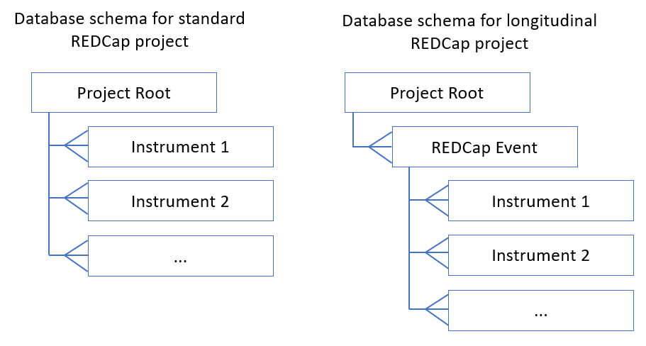

The redcap_importer is a Django app that can be used to import a project from REDCap
into a relational database using the REDCap API. Data can be imported into any database
system supported by Django.

The tool will get the data dictionary for the project using the API and generate the Django ORM
code you need to build your database. The data schema is specific to the REDCap project:




## Set Up a Relational Database for a New Project

You must already have a working Django project. See the
[Django documentation](https://www.djangoproject.com/) for how to set up Django.

1. Install the app from GitHub using pip

    ```
    pip install git+https://github.com/Center-for-Health-Informatics/redcap_importer.git#egg=redcap_importer
    ```
    
2. Update your Django settings
   
    ```python
    # in your Django settings.py
    
    INSTALLED_APPS = [
        ...
        'redcap_importer',
    ]
    
    # (optional) in your urls.py
    
    urlpatterns = [
        ...
        path('redcap_importer/', include(('redcap_importer.urls', 'redcap_importer'), namespace='redcap_importer')),
    ]
    ```
    
2. Run migrations to install redcap_importer system tables

    ```
    python manage.py migrate
    ```
    
5. Set connection info for your REDCap project in the database

   - If you run your Django site and go to the Django admin section, you should be able to see
     the redcap_importer models you just created. 

   - First you must provide the API URL in the RedcapApiUrl table. 
      - name: anything
      - URL:  should be something like `https://redcap.research.cchmc.org/api/`.
   - Then in the RedcapConnection table, provide information about your project
      - unique_name: anything, but must be alphanumeric/dashes/underscores only
      - note: This unique_name will be used to reference the REDCap project everywhere else in this tool.
      - api_url: Select the URL to use

6. Provide your REDCap API key
   - You must also provide an API key from REDCap for this project. This can be obtained from the REDCap website. For security reasons, this goes into your Django `settings.py` file instead of into the database. Use the `RedcapConnection.unique_name` you created in step 5 to reference the project.

    ```
    REDCAP_API_TOKENS = {
        'project1': '11111111111111111111111111111111111',
        'project2': '11111111111111111111111111111111111',
        ...
    }
    ```

7. Create a new Django app where your database models will go

    ```
    # give the app the same name as you used in RedcapConnection.unique_name

    python manage.py start_app project1

    # and then add the app to your installed apps in settings.py

    INSTALLED_APPS = [
        ...
        'redcap_importer',
        'project1',
    ]
    ```

8. Set up the database for your project

    ```
    # see a list of all projects you have set up
    python manage.py redcap_list_connections
    
    # get the latest data dictionary for your project
    python manage.py redcap_get_dd project1
    
    # use the data dictionary to create your model code
    python manage.py redcap_write_models project1
    
    # this code can be written directly to the models.py file for your app
    python manage.py redcap_write_models project1 > project1/models.py
    
    # create the database tables for your new models
    python manage.py makemigrations project1
    python manage.py migrate
    
    ```


## Load Data from REDCap into Your Database

Once your database is set up, you can load data anytime using the provided script

```
python manage.py redcap_load_data project1
```


## How do I load partial data?

If you don't want to load the entire REDCap project (in order to save time), you can specify the instruments using the REDCap Connections model in the Django admin.

- check the partial_load box to set to true

- provide the names of the instruments you want to include. All other instruments will be ignored.

NOTE: The database schema for the entire database is still created. But during the ETL the data will not be loaded.


## How do I handle changes to the original REDCap project?

If the data dictionary for the REDCap project is changed after you've set up your database, it may break the ETL.

- changes that will break the ETL:
  - an instrument or field is renamed or deleted
  - new REDCap events are added (only applies to longitudinal projects)
- changed that will not break the ETL:
  - new instruments or fields are added (but this new data won't be imported)

You can get a list of all changes since your last imported the data dictionary

```
python manage.py redcap_change_report project1
```

To Update your database with the latest version of the REDCap project:

1. import the data dictionary again
   ```
   python manage.py redcap_get_dd project1
   ```

2. Update your Django models and database

    ```
    python manage.py redcap_write_models project1 > project1/models.py
    python manage.py makemigrations project1
    python manage.py migrate
    ```

3. Redownload the latest data

   ```
   python manage.py redcap_load_data
   ```


